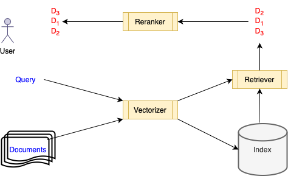

# Neural search demos
In this repository, we demonstrate a number of key neural document search methods and concepts.
Typical search systems, as studied in NLP are depicted by the diagram below. Their aim is to
retrieve the set of all documents $d$ that are **relevant** or answer a given user question (a.k.a. "query") $q$.

They typically consist of an **index**, a store for persisting documents to disk, and allowing fast search.
A **retriever** $r$, a method that determines which of the indexed documents are relevant for the query, generating
an answer set of **ranked hits** $Ans^r(q)$.

As retrievers tend to have their shortcomings when it comes to search quality, it is common to combine them with a downstream **reranker**, that sorts again $Ans^r(q)$, and, if successful, pushes upwards relevant answers.

<p align="center">
  
</p>

In **neural** search we are interested in retrievers and re-rankers that are underpinned by deep learning models (as of 2025, flavors of BERT). 

**Dataset**

For the experiments described we rely on the [Cranfield](https://huggingface.co/datasets/irds/cranfield) corpus.
This is a small corpus of 1,400 scientific abstracts and 225 questions (both with redundancies).

The Cranfield corpus assigns a relevance score ranging from -1 to 3 to positive answers to a user query.
For simplicity, we disregard such fine-grained classification, and collapse them to a single label.

<div align="center">

|        | Unique queries | Unique documents|
|------- |--------------- |-----------------|     
|train   | 152            | 684             |
|test    | 5              | 138             |
|total   | 157            | 732             |

</div>

## Retrievers

### Okapi BM25 search

[Okapi BM25](https://en.wikipedia.org/wiki/Okapi_BM25) is a variation of TFIDF. It is also
known as **lexical** search, as essentially, it compares documents to queries on the grounds
of their shared **terms** or vocabulary.

Consider query $q$ as composed of $n$ keywords $t_i,\dots,t_n$, and assume the target 
document $v$ to match is a bag of $m$ words or terms. Then:

$$
\text{bm25}(q, v) = \sum_{i=1}^n \text{idf}(t_i) * \frac{\text{tf}(t_i, v) * 
        (k_1 + 1)} {\text{tf}(t_i, v) + k_1 * \left(1 - b + b * \frac{m}{avgdl} \right)}
$$

where $\text{tf}(q_{i},v)$ is the number of times that the keyword $t_i$ occurs in $v$, and $avdgl$ is the average document length of a document in the document collection $D$ indexed. $k_1$ and $b$ are hyper-parameters, set by default to $k_1 \in [1.2, 2.0]$ and $b=0.75$. The inverse document frequency of $t_i$ is defined as follows:

$$
\text{idf}(t_i) = \ln \left(\frac{ |D| - n(t_i) + 0.5 } { n(t_i) + 0.5} + 1\right)
$$

with $n(t_i)$ the number of documents in $D$ where $t_i$ appears.

### L2 (Euclidian) search

While BM25 is both effective and cheap to deploy, it has a major drawback, namely that it can't deal very well
with synnonyms or out-of-vocabulary (OOV) terms and words. Meaning by this that if a user query uses terms that are not mentioned explicitly somewhere in the documents, $Ans^r(q)$ will contain few --if any-- relevant documents.

To remedy this, conterporary search systems rely instead on **semantic search**. In semantic search, we use
pre-trained deep learning embedding models (flavors of BERT encoder-only transformers) to map queries $q$ and documents $d$ into vectors in a common space. Search in this context consists in either minimizing the distance
of $\vec{q}$ to $\vec{d}$, or maximizing their (cosine) similarity. The advantage of semantic search is
that 

In this demo, we rely on a [sentence mebedding](https://www.sbert.net) model to vectorize $d$ and $q$, and
[FAISS](https://faiss.ai/) to index and compute $Ans(q)$ using $k$ nearest neighbor L2 Euclidian search.

Consider a $k$-dimensional embedding (vector representation) $\vec{q}$ of query $q$, and 
a $k$-dimensional embedding $\vec{q}$ of document $d$.
Then the [L2-norm](https://mathworld.wolfram.com/L2-Norm.html) is defined as the Euclidian distance between $\vec{q}$ and $\vec{d}$, namely:

$$
\text{l2}(q,d) = \sqrt{ \sum_{i=1}^k (\vec{q}_i - \vec{d_i})^2 }
$$

## Rerankers

### Reranking with a cross-encoder

A [cross-encoder](https://www.sbert.net/examples/applications/cross-encoder/README.html) is a 
query-document pair (pre-trained) **classifier**, that returns $1$ when $d$ is relevant for $q$ and 0 otherwise.
In practice, we're interested in the likelihood (softmax probabilty) of label $1$, and use it to re-rank
(sort again) $Ans^r(q)$. As of 2025, variations of BERT are used for this purpose.

###  Reranking with reciprocal rank fusion

In [reciprocal rank fusion](https://rodgerbenham.github.io/bc17-adcs.pdf) the idea is
to boost overall search quality by combining the results of multiple rankers $r$:

$$
  \text{rrf}(d) = \sum_{r \in R} \left( \frac{1}{k + r(d)} \right)
$$

where $r(d)$ is the rank of $d$ in $Ans^r(q)$. The higher $\text{rrf}(d)$, the more relevant $d$.
Notice that this score is computed solely on the **rankings** of the documents vs the scores
returned by the base rankers.

In particular, we combine lexical search (BM25) and semantic search (FAISS/L2) results.

## Evaluation

### Metrics

There are many performance metrics for search systems. In the context of this demo, we focus
we rely only on **precision, recall and F1-score at ranking level $k$**. 
What this means is that we:
* restrict $Ans(q)$ to the top $k$ hits $Ans_k^r(q)$ according to ranking metric $r$ (viz., BM25, W2V cosine, bi-encoder cosine)
* check if document $d_i$ at ranking level $1 \leq i \leq k$ is relevant for query $q$

$$
    P{@}k = \frac{TP_k}{TP_k + FP_k} \qquad 
    R{@}k = \frac{TP_k}{TP_k + FN_k} \qquad 
    F1{@}k = \frac{2 \cdot P{@}k \cdot R{@}k}{P{@}k + R{@}k}   
$$

### Results

For the full results, please check the precision, recall and F1-score plots under `results/`. Here we give
only a high-level summary at rank $k=5$, consisting of micro-averages for the five queries chosen as test set.

BM25 and FAISS give somewhat similar results, even though the FAISS method is 2x slower. On the other hand, it supports queries with OOV terms.

Interestingly, reranking with a pre-trained cross encoder (which increases latency > 2x) actually degrades results. By contrast, RRF significatly increases precision.

<div align="center">

Method                  | P@5      | R@5      | F1@5 
-------                 |------    |------    |------
BM25                    | 0.32     | 0.06     | 0.10
FAISS                   | 0.32     | 0.06     | 0.10
FAISS + cross-encoder   | 0.16     | 0.03     | 0.05
BM25  + cross-encoder   | 0.20     | 0.03     | 0.06
BM25  + FAISS + RRF     | 0.40     | 0.07     | 0.15

</div>

## Running the experiments

You can reproduce these results by cloning this repository. We assume the reader to be proficient in Bash, and that he/she
has installed and configured the Miniconda/Anaconda virtual environment and package manager. Thereafter it should suffice to type:

```bash
conda create -n search_demo python=3.10.12
conda activate search_demo
pip install -r requirements.txt
python main.py
```
